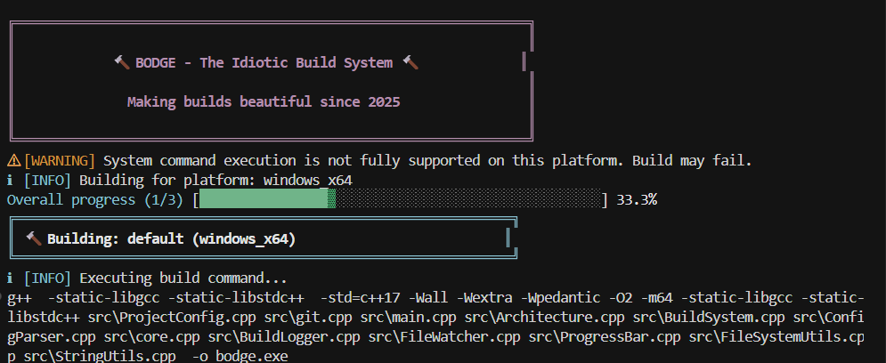

# Bodge - The Idiotic Build System

A minimalistic but powerful C++ build system that reads from a simple configuration file.
It aims to be a replacement for CMAKE one day and make it more easy and reliable to build C++ and C projects.

bodge [/bɒdʒ/ verb: make or repair (something) badly or clumsily.]

[Find a full documentation here](https://el-dockerr.github.io/bodge)

This buildsystem is the draft to overcome typical issues of CMAKE. The vast of dependencies and the chaos it causes should be solved in a 
modern more package like approach. In Bodge you just point out the dependencies and what compiler to be used and the flags.
Everything straight forward without complex commands. Bodge also solves 3rd party dependencies with git support, where you can define sources, pull them 
and add them to the build chain. Other features will be added step by step.

The major goal is to have one little program what makes the build of C++ software easy like maven in Java or Cargo in Rust.

## Screenshot




## Download

Pre-compiled binaries are available in [Releases](https://github.com/el-dockerr/bodge/releases) for Windows, Linux, and macOS.

## Building the Project

### Using bodge (preferred)
```bash
bodge --platform=windows_x86
```

To choose the right platform use:
```bash
bodge platform
```
You can add your own targets in `.bodge`

Yes it is that easy !!! Bodge can be already build by bodge

### Using Make
```bash
make all        # Build the project
make clean      # Clean build artifacts
make debug      # Build with debug symbols
make install    # Install to system (Unix/Linux)
```

### Using Windows (mingw)
```bash
./make.bat
```

### Using CMake
```bash
mkdir build && cd build
cmake ..
make
```

### Manual Compilation
```bash
g++ -std=c++17 -Wall -Wextra -Isrc src/*.cpp -o bodge
```

## Key Features

### **Multi-Target Support**
- Build executables, shared libraries (DLLs/SOs), and static libraries
- Per-target configuration with global defaults
- Automatic file extension handling for different platforms

### **Build Sequences**
- Chain multiple build and file operations
- Copy, remove, and create directory operations
- Perfect for deployment workflows

### **Advanced Build System**
- Cross-platform compatibility (Windows/Linux)
- Static linking support to eliminate DLL dependencies
- Comprehensive error handling and logging

### **Automatic Source Collection**
- Use `src/**` to automatically collect all C++ files from directories
- Recursive pattern matching with `**` and single directory with `*`
- Automatic dependency analysis and build order optimization
- No need to manually list every source file

### **File Operations**
- Built-in file and directory copying
- Safe file/directory removal
- Directory creation with parent path handling

### **Daemon Mode - Automatic Rebuilds**
- Watch mode that monitors source files for changes
- Automatically triggers rebuilds when files are modified
- Comprehensive build logging with timestamps and error tracking
- Configurable polling intervals
- Perfect for active development and continuous integration

### **fetch sources from other repositories**
- No hassle about fetch and pull
- Dependencies can setup fluently

### **Cross-Platform & Architecture-Aware Building**
- Automatic platform detection (Windows, Linux, Unix, macOS)
- Architecture-specific builds (x86, x64, ARM, ARM64)
- Platform-specific compiler flags and configurations
- Build for multiple platforms from a single configuration
- Platform-specific source files and dependencies

## Benefits of This Modular Design

1. **Single Responsibility Principle**: Each class has one clear purpose
2. **Testability**: Individual components can be unit tested in isolation
3. **Maintainability**: Changes to one component don't affect others
4. **Reusability**: Utility classes can be reused in other projects
5. **Readability**: Code is organized logically and easy to navigate
6. **Extensibility**: New features can be added without major refactoring
7. **Multi-Target Support**: Build multiple outputs from one configuration
8. **Workflow Automation**: Sequences enable complex build and deploy workflows

## Usage

### Basic Usage
Create a `.bodge` configuration file and run:

```bash
./bodge              # Build all targets
./bodge help         # Show help
./bodge list         # List available targets and sequences
```

### Advanced Usage with Targets and Sequences

```bash
./bodge build mylib               # Build specific target
./bodge sequence deploy           # Execute specific sequence
./bodge platform                  # Show platform information
./bodge --platform=windows_x64    # Build only for this platform
./bodge watch                     # Watch mode: auto-rebuild on file changes
./bodge daemon --interval=2000    # Daemon with custom polling interval
./bodge --arch=x86                # Build only for targets from architecture x86
```

### Configuration Examples

#### Simple Configuration with Automatic Source Collection:
```
name: MyProject
compiler: g++
output_name: my_app
cxx_flags: -std=c++17, -Wall, -O2
sources: src/**
include_dirs: include
libraries: pthread, m
```

#### Legacy Configuration (Manual File Listing):
```
name: MyProject
compiler: g++
output_name: my_app
cxx_flags: -std=c++17, -Wall, -O2
sources: main.cpp, utils.cpp
include_dirs: include
libraries: pthread, m
```

#### Advanced Multi-Target Configuration:
```
name: Multi-Target Project
compiler: g++

# Global settings for all targets
global_cxx_flags: -std=c++17, -Wall, -static-libgcc, -static-libstdc++
global_include_dirs: include

# Main executable target (automatic source collection)
main.type: exe
main.output_name: my_app
main.sources: src/**
main.libraries: mylib

# Shared library target (automatic source collection)
mylib.type: shared
mylib.output_name: mylib
mylib.sources: src/lib/**
mylib.cxx_flags: -O2, -fPIC

# Static library target (automatic source collection)
tools.type: static
tools.output_name: tools
tools.sources: src/tools/**

# Build sequence
sequence.build_all: build:mylib build:tools build:main

# Deploy sequence with file operations
sequence.deploy: build:main mkdir:dist copy:my_app.exe->dist/my_app.exe copy:config->dist/config

# Clean sequence
sequence.clean: remove:*.exe remove:*.dll remove:dist
```

#### Architecture-Aware Configuration:
```
name: Cross-Platform Project
compiler: g++

# Build for multiple platforms
platforms: windows_x64, linux_x64, windows_x86

# Global platform-specific settings
@windows.cxx_flags: -static-libgcc, -static-libstdc++
@linux.cxx_flags: -pthread
@x86.cxx_flags: -m32
@x64.cxx_flags: -m64

# Main application with platform-specific configurations
app.type: exe
app.output_name: my_app
app.sources: src/main.cpp, src/common.cpp

# Platform-specific source files
app@windows.sources: src/windows_impl.cpp
app@linux.sources: src/linux_impl.cpp

# Platform-specific libraries
app@windows.libraries: kernel32, user32
app@linux.libraries: dl, rt

# Platform-specific output suffixes
app@windows_x64.output_suffix: _x64
app@windows_x86.output_suffix: _x86
app@linux_x64.output_suffix: _linux64
```

### Supported Target Types
- `exe` / `executable` - Executable programs (.exe on Windows)
- `shared` / `dll` / `so` - Shared libraries (.dll on Windows, .so on Linux)
- `static` / `lib` - Static libraries (.lib on Windows, .a on Linux)

### Supported Platforms
- `windows_x86` / `windows_x64` - Windows 32-bit/64-bit
- `linux_x86` / `linux_x64` - Linux 32-bit/64-bit  
- `unix_x86` / `unix_x64` - Unix 32-bit/64-bit
- `apple_x86` / `apple_x64` - macOS 32-bit/64-bit
- `*_arm` / `*_arm64` - ARM 32-bit/64-bit (any OS)

### Platform Configuration Syntax
- `platforms: platform1, platform2` - Set default target platforms
- `@platform.property: value` - Global platform-specific configuration
- `target@platform.property: value` - Target-specific platform configuration
- `target.platforms: platform1, platform2` - Platforms for specific target

### Supported Operations in Sequences
- `build:target_name` - Build a specific target
- `copy:source->destination` - Copy files or directories  
- `remove:path` - Remove files or directories
- `mkdir:path` - Create directories

## License

Bodge License (BL-V1.0)